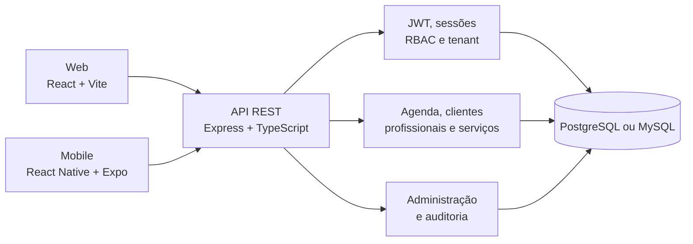
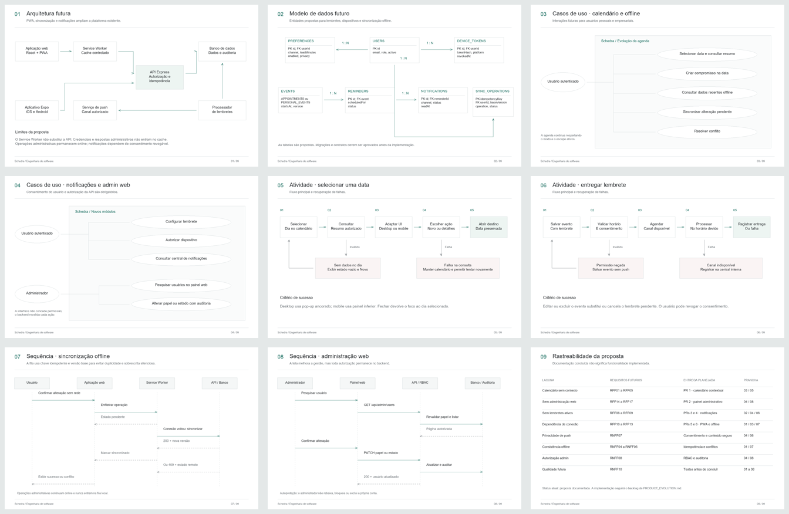

<div align="center">

# Schedra

### Agenda pessoal e operação empresarial no mesmo produto

[](https://schedra.app/login)
[](Frontend-Schedra)
[](Aplicativo-Schedra)
[](Backend-Schedra)
[](docs/diagrams/schedra-database.dbml)

O Schedra concentra compromissos pessoais e a rotina de pequenos negócios em uma plataforma web e mobile, com autenticação, agenda, cadastros operacionais, administração e isolamento entre organizações.

[Abrir aplicação](https://schedra.app/login) · [Documentação](docs/README.md) · [Proposta de evolução](docs/PROPOSTA.md) · [DER no dbdiagram](https://dbdiagram.io/d/Schedra-DER-completo-6aabd504b73118d200aba4ce)

</div>

> **Status:** produto acadêmico funcional em evolução. Web, aplicativo Expo, API, banco, autenticação, agenda pessoal e empresarial, RBAC, auditoria e painel administrativo mobile estão implementados. Calendário contextual, notificações, PWA, operação offline e painel administrativo web fazem parte da evolução documentada.

## Por que o Schedra existe

Agendas pessoais e operações de atendimento costumam ficar espalhadas entre mensagens, planilhas e anotações. O Schedra organiza esses contextos sem obrigar o usuário a manter contas diferentes: a mesma sessão alterna entre o modo pessoal e o empresarial, respeitando permissões e dados de cada organização.

## Experiências do produto

| Modo | Entregas principais |
| --- | --- |
| **Pessoal** | Calendário mensal, criação e acompanhamento de compromissos, histórico e visão dos próximos horários. |
| **Empresarial** | Timeline e lista de agendamentos, clientes, profissionais, serviços e operação por organização. |
| **Administrativo** | Gestão mobile de usuários, papéis e estado das contas, protegida por permissão. |
| **Conta** | Cadastro, login, sessão persistente, perfil, foto, alteração de dados e senha. |

## Fluxo principal

1. O usuário cria uma conta ou entra com suas credenciais.
2. No aplicativo, escolhe entre o contexto pessoal e empresarial com transição animada.
3. No modo pessoal, registra compromissos próprios e consulta o calendário.
4. No modo empresarial, administra clientes, profissionais, serviços e agendamentos.
5. A API revalida sessão, papel, permissão e organização antes de acessar ou alterar dados.
6. Administradores autorizados gerenciam contas pelo painel mobile, com ações auditáveis.

## Arquitetura atual



O frontend web e o aplicativo consomem a mesma API. No backend, o fluxo segue `rota → controller → service → model/repository → banco`, mantendo autorização e regras de negócio fora das interfaces.

### Organização do repositório

```text
Horarius/
├── Frontend-Schedra/      # SPA React e Vite
├── Backend-Schedra/       # API Express e TypeScript
├── Aplicativo-Schedra/    # Aplicativo React Native e Expo
├── docs/                  # Proposta, requisitos, diagramas e operação
├── infra/                 # Nginx e certificados locais
├── tests/                 # Cenários end-to-end
└── docker-compose.yml     # Banco, API, web e proxy reverso
```

## Modelo de dados

O schema completo possui entidades de identidade, sessões, organizações, permissões, clientes, profissionais, serviços, compromissos pessoais, agendamentos empresariais e auditoria. O arquivo versionado pode ser importado diretamente no dbdiagram.

- [Abrir DER completo no dbdiagram](https://dbdiagram.io/d/Schedra-DER-completo-6aabd504b73118d200aba4ce)
- [Consultar o DBML versionado](docs/diagrams/schedra-database.dbml)
- [Entender as decisões de arquitetura](docs/SCHEDRA_PRODUCT_ARCHITECTURE.md)

## Evolução planejada

As pranchas abaixo documentam **implementações futuras**, não funcionalidades já concluídas. A proposta cobre calendário contextual, lembretes, notificações, PWA, sincronização offline e administração web.

[](docs/PROPOSTA.md)

<table>
  <tr>
    <td width="50%"><a href="docs/diagrams/01.png"></a></td>
    <td width="50%"><a href="docs/diagrams/02.png"></a></td>
  </tr>
  <tr>
    <td align="center"><strong>Arquitetura futura</strong></td>
    <td align="center"><strong>Expansão do modelo de dados</strong></td>
  </tr>
</table>

Todos os requisitos, limites, critérios de aceite e vínculos com os diagramas estão consolidados na [proposta de evolução](docs/PROPOSTA.md). O arquivo editável está em [Schedra-revisado.excalidraw](docs/diagrams/Schedra-revisado.excalidraw).

## Stack

| Camada | Tecnologias |
| --- | --- |
| **Web** | React 18, Vite, TypeScript, Material UI, Radix UI, Tailwind CSS e Vitest |
| **Mobile** | React Native, Expo SDK 57, React Navigation, Secure Store e Async Storage |
| **API** | Node.js, Express 5, TypeScript, Sequelize, JWT, Multer, Sharp e Jest |
| **Dados** | PostgreSQL em produção e suporte a MySQL via Sequelize |
| **Infraestrutura** | Docker Compose, Nginx, HTTPS local, Vercel e GitHub Actions |
| **Qualidade** | TypeScript, Jest, Vitest, Playwright, Husky e Commitlint |

## Segurança e regras de negócio

- Tokens de acesso curtos e sessões de atualização revogáveis.
- Senhas armazenadas como hash e validação de senha forte no cadastro.
- Controle de acesso por papel e permissão, sempre revalidado na API.
- Isolamento multiempresa por organização em consultas e alterações.
- Proteção contra conflito de horários e gravações concorrentes.
- Upload de avatar com validação, processamento e limites controlados.
- Rate limit, CORS configurável, auditoria e endpoints de saúde.
- Seeds administrativos desabilitados por padrão em produção.

## Rotas principais

| Rota | Finalidade |
| --- | --- |
| `/login` e `/cadastro` | Entrada e criação de conta |
| `/agenda/timeline` | Visão temporal da agenda empresarial |
| `/agenda/lista` | Pesquisa e operação sobre agendamentos |
| `/clientes` | Cadastro e gestão de clientes |
| `/profissionais` | Cadastro e gestão de profissionais |
| `/servicos` | Cadastro e gestão de serviços |
| `/perfil` | Dados e segurança da conta |
| `/api/health` | Verificação de disponibilidade da API |

## Como rodar

### Ambiente completo com Docker

```bash
copy .env.example .env
npm install
npm run compose:up
```

Com certificados locais configurados em `infra/nginx/certs` e `127.0.0.1 schedra.app` no arquivo de hosts, a aplicação fica disponível em `https://schedra.app`.

### Serviços separados

```bash
# API - http://localhost:3333
cd Backend-Schedra
npm install
npm run dev

# Web - endereço exibido pelo Vite
cd Frontend-Schedra
npm install
npm run dev

# Mobile - QR code do Expo
cd Aplicativo-Schedra
copy .env.example .env
npm install
npm start
```

No celular, ajuste `EXPO_PUBLIC_API_URL` para o IP da máquina na mesma rede, por exemplo `http://192.168.0.10:3333/api`.

## Qualidade

```bash
# Typecheck e testes de backend, mobile e web, além do build web
npm run quality

# Cenários end-to-end
npm run test:e2e
```

O workflow em `.github/workflows/quality.yml` executa as verificações automatizadas do projeto no GitHub Actions.

## Documentação

| Documento | Conteúdo |
| --- | --- |
| [Índice da documentação](docs/README.md) | Ponto de entrada e ordem sugerida de leitura |
| [Proposta de evolução](docs/PROPOSTA.md) | Lacunas atuais e implementações futuras |
| [Requisitos futuros](docs/REQUIREMENTS.md) | Requisitos funcionais, não funcionais e aceite |
| [Diagramas](docs/DIAGRAMS.md) | Arquitetura, casos de uso, atividades e sequências |
| [Arquitetura do produto](docs/SCHEDRA_PRODUCT_ARCHITECTURE.md) | Domínio, dados e decisões técnicas |
| [Operação](docs/OPERATIONS.md) | Deploy, saúde, métricas, backup e recuperação |
| [Revisão de segurança](docs/SECURITY_REVIEW.md) | Controles existentes e riscos acompanhados |
| [Rastreabilidade da rubrica](docs/RUBRICA_MOBILE_2026.md) | Evidências e separação entre atual e futuro |

## Autor

**Luiz Otávio Mello de Campos** — Análise e Desenvolvimento de Sistemas

[GitHub](https://github.com/Luizbc2) · [LinkedIn](https://www.linkedin.com/in/luiz-otavio-mello-de-campos-66699224b/)
