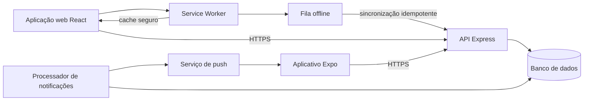
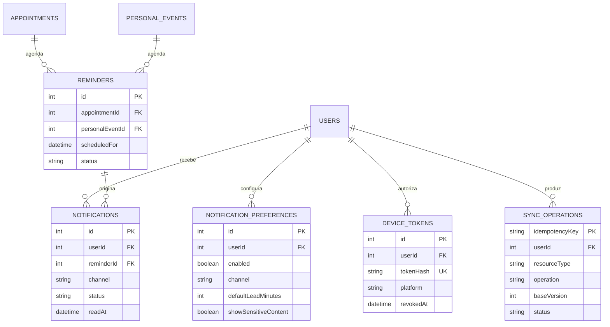
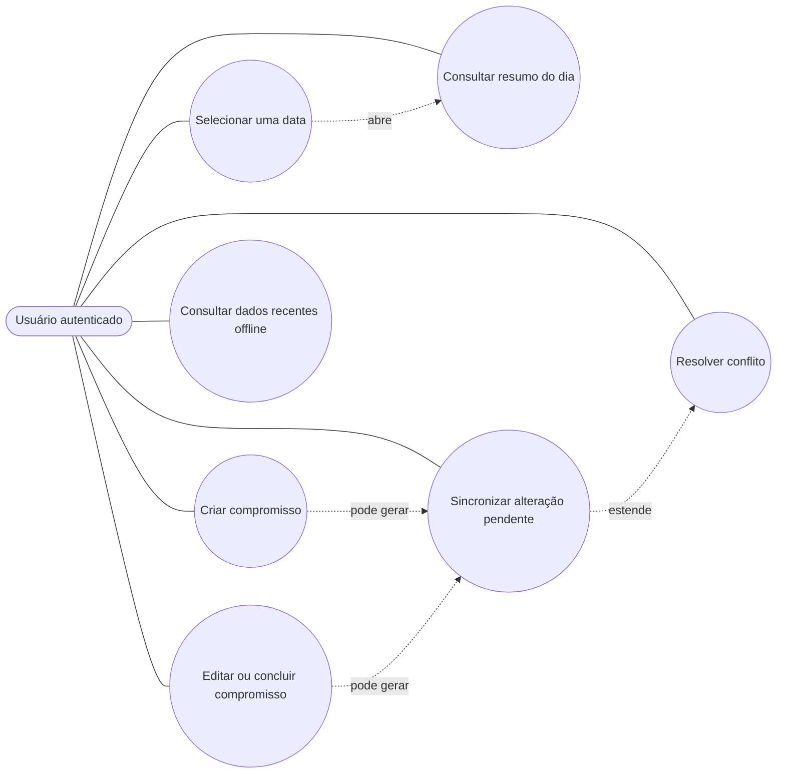
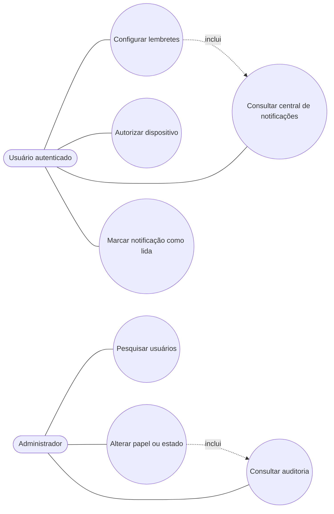
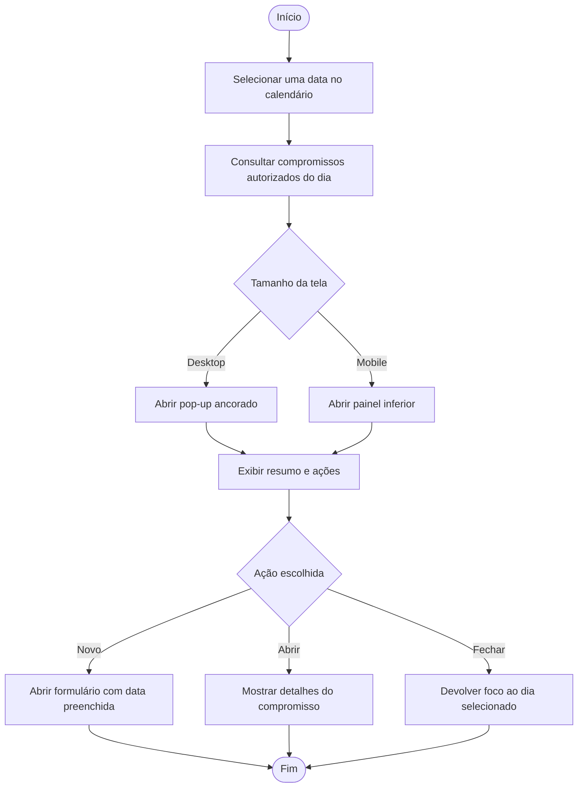
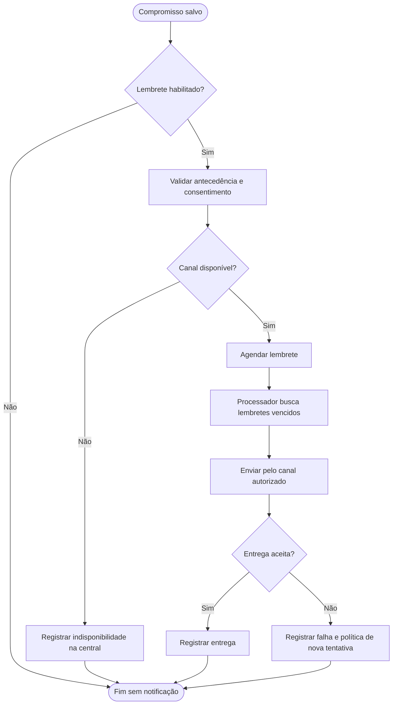
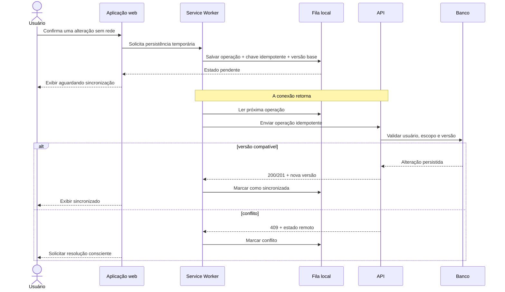
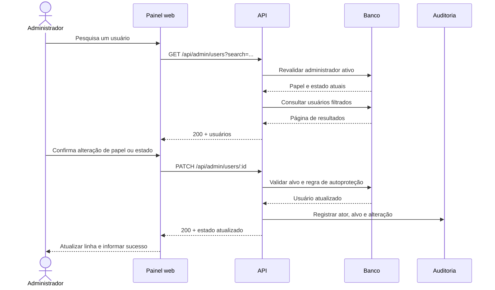

# Diagramas das implementações futuras do Schedra

> Catálogo técnico. A proposta consolidada com os diagramas incorporados está em [PROPOSTA.md](PROPOSTA.md).

Os diagramas desta seção representam a solução proposta para lacunas ainda existentes. Eles não afirmam que os componentes, tabelas ou fluxos já estejam implementados.

Versão visual editável: [Schedra-revisado.excalidraw](diagrams/Schedra-revisado.excalidraw). Prévia das nove pranchas: [overview.png](diagrams/overview.png).

## Banco atual

O DER completo do banco existente está em [schedra-database.dbml](diagrams/schedra-database.dbml), pronto para importação no dbdiagram. A [visualização online no dbdiagram](https://dbdiagram.io/d/Schedra-DER-completo-6aabd504b73118d200aba4ce) apresenta todas as tabelas e relações em formato enxuto. O modelo contém 34 tabelas de domínio, a tabela técnica `schema_migrations` e 56 relacionamentos. O DER desta página, por outro lado, descreve apenas a evolução futura.

## 1. Arquitetura proposta

O Service Worker atende somente a aplicação web. Ele preserva o shell e leituras autorizadas, mas não substitui a API. O processador de notificações consulta lembretes pendentes e registra o resultado de cada tentativa.

## 2. DER proposto para lembretes e sincronização

## 3. Caso de uso proposto - calendário e operação offline

## 4. Caso de uso proposto - notificações e administração web

## 5. Atividade proposta - interação com uma data

## 6. Atividade proposta - preparar e entregar lembrete

## 7. Sequência proposta - escrita offline e sincronização

## 8. Sequência proposta - administração web

## 9. Rastreabilidade da proposta

| Lacuna | Requisitos | Diagramas | Entrega planejada |
| --- | --- | --- | --- |
| Calendário sem interação contextual | RFF01-RFF05 | 3 e 5 | PR 1 |
| Ausência de lembretes | RFF06-RFF09 | 2, 4 e 6 | PRs 3 e 4 |
| Dependência integral de conexão | RFF10-RFF13 | 1, 3 e 7 | PRs 5 e 6 |
| Ausência de administração web | RFF14-RFF17 | 4 e 8 | PR 2 |

## 10. Evidência exigida para considerar uma proposta concluída

Uma proposta só muda de `Planejada` para `Concluída` quando possuir código integrado, testes automatizados, validação manual no ambiente correspondente e atualização desta rastreabilidade. O diagrama isoladamente comprova apenas análise e projeto.
