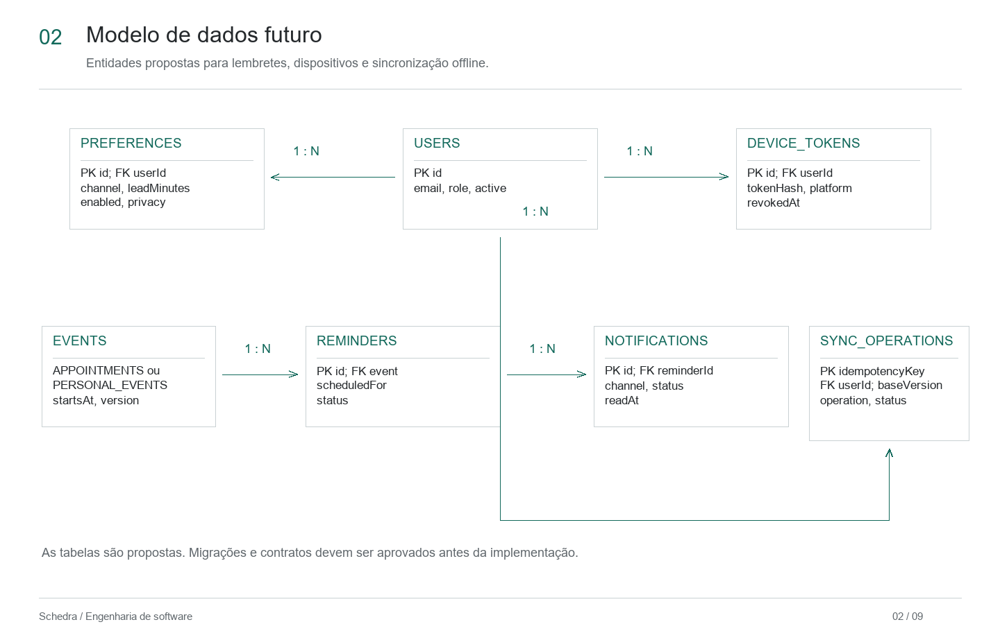
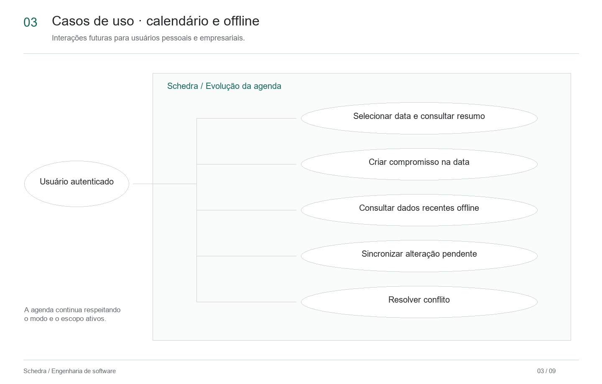
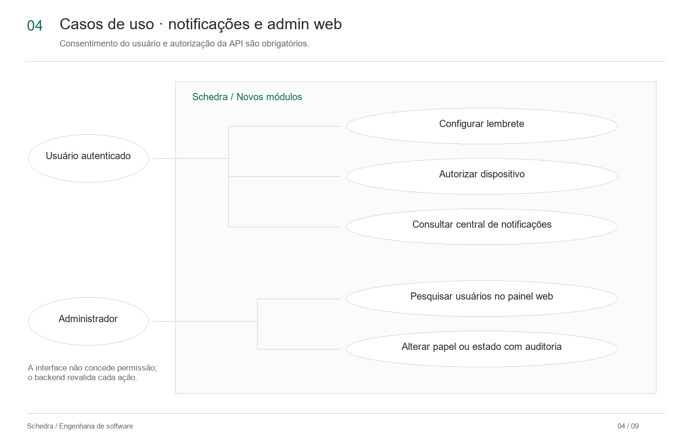
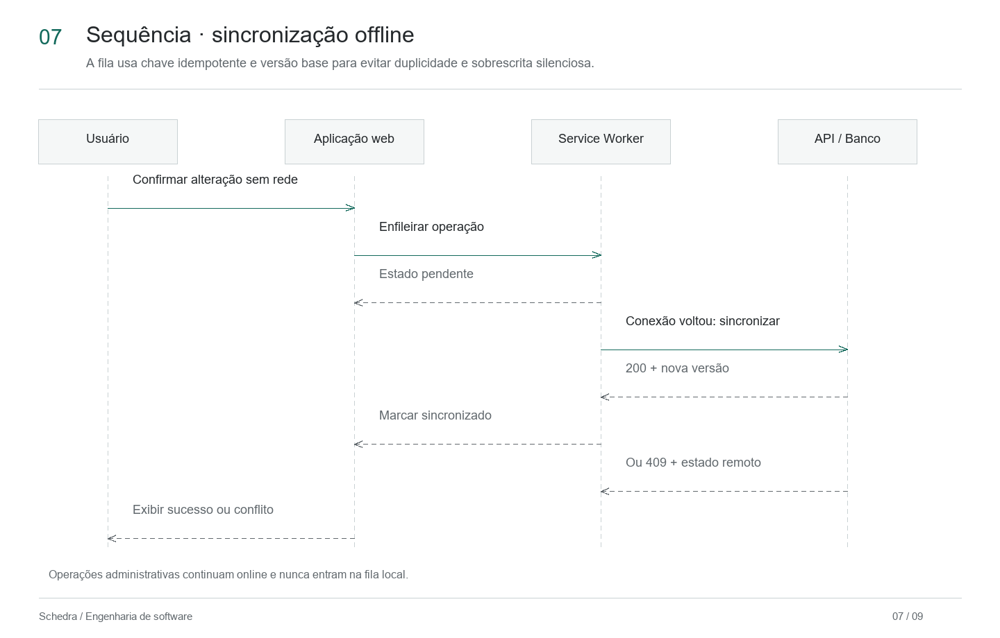
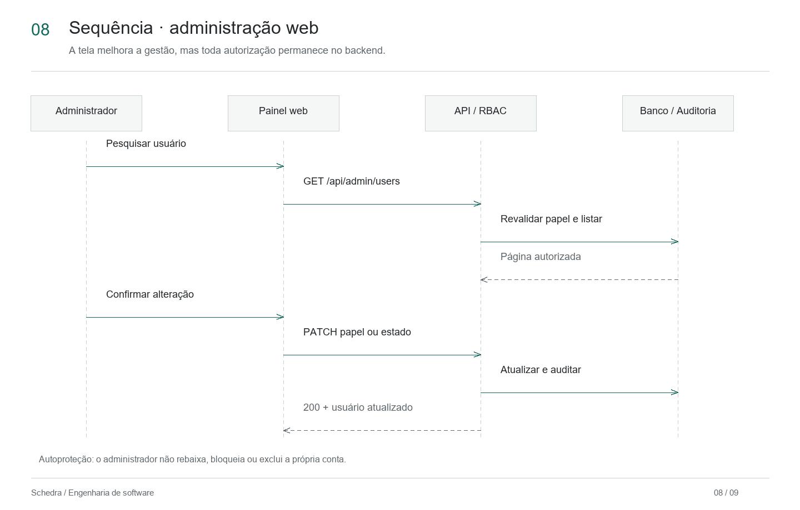
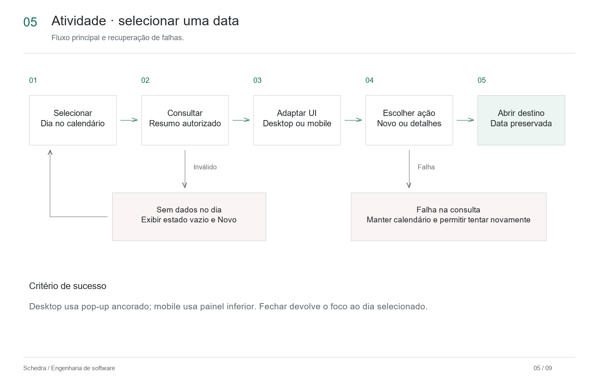
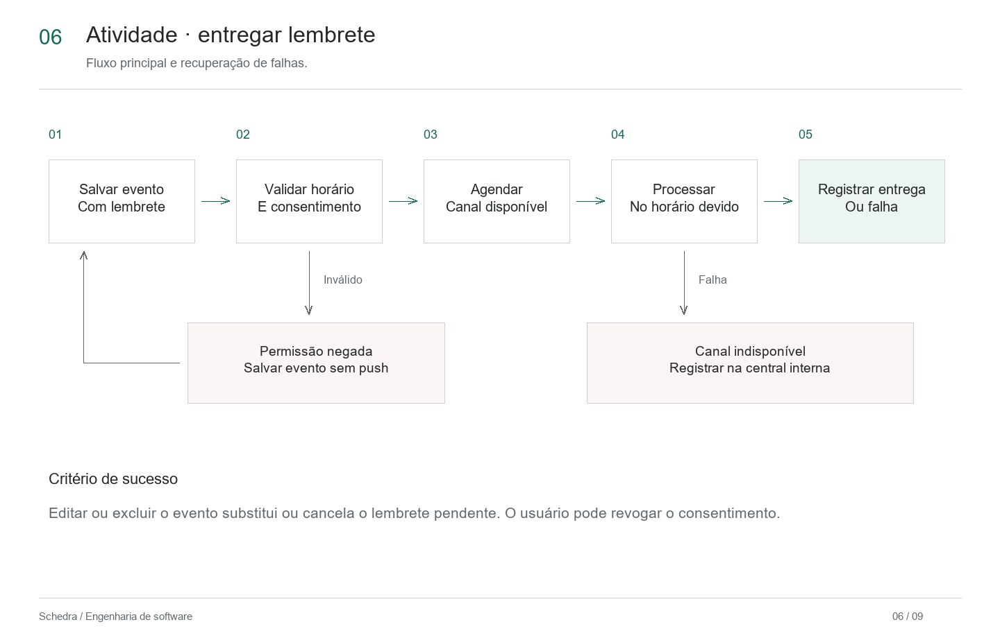
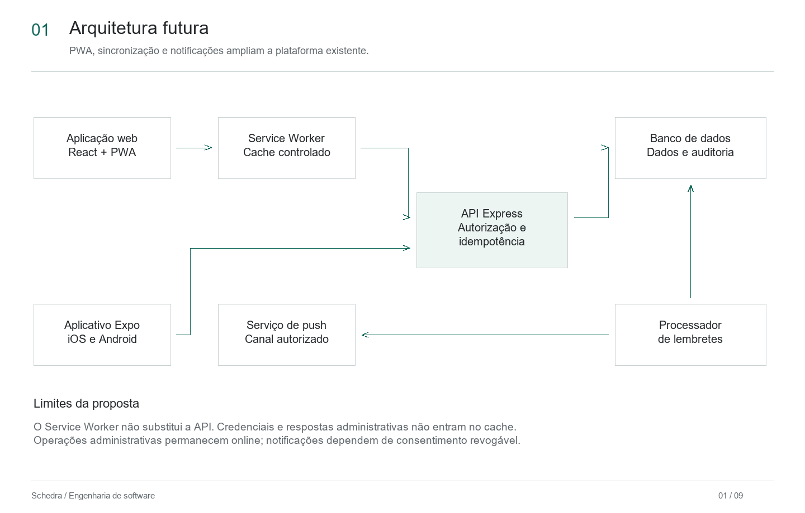

# Schedra - proposta de evolução

## Calendário inteligente, notificações, continuidade offline e administração web

### Resumo

O Schedra é uma plataforma de organização de agenda disponível na web e em aplicativo móvel. O sistema atende rotinas pessoais e empresariais, compartilhando autenticação, regras de negócio, API e banco de dados.

Esta proposta descreve funcionalidades que ainda serão implementadas. O sistema existente é citado somente como base técnica; requisitos, tabelas e diagramas futuros não devem ser apresentados como funcionalidades concluídas.

### Por que existe

Pessoas e pequenos negócios distribuem compromissos entre agendas, mensagens e anotações. Essa fragmentação dificulta encontrar horários livres, acompanhar mudanças e lembrar tarefas importantes. O Schedra concentra essas rotinas em uma experiência adequada ao contexto pessoal ou empresarial.

### Por que evoluir o sistema

| Necessidade | Problema atual | Evolução proposta |
| --- | --- | --- |
| **Interação direta com o calendário** | A visualização atual não permite abrir um resumo completo ao selecionar uma data. | Exibir pop-up no desktop e painel inferior no celular, com compromissos e ações contextuais. |
| **Lembretes configuráveis** | Compromissos são registrados, mas o usuário não recebe lembretes ativos nem acompanha tentativas de entrega. | Criar preferências, central interna e ciclo de agendamento, entrega, leitura, falha e cancelamento. |
| **Continuidade durante falhas de rede** | A aplicação web depende de conexão para carregar e registrar informações. | Transformar a web em PWA, armazenar somente conteúdo permitido e sincronizar escritas pendentes de forma idempotente. |
| **Administração em tela ampla** | O controle administrativo existe no aplicativo móvel, mas não possui uma experiência própria na web. | Criar painel web responsivo para pesquisa, alteração de papel, bloqueio, reativação e auditoria. |

## 1. Objetivos e limites da proposta

A evolução será organizada em duas frentes:

- **Agenda inteligente e continuidade:** calendário contextual, lembretes, central de notificações, PWA e sincronização offline.
- **Administração web e governança:** pesquisa de usuários, alteração de papel ou estado, confirmações e auditoria.

A primeira versão das notificações oferecerá central interna e lembretes locais no aplicativo. Push remoto será validado em development build, pois depende do registro do dispositivo e não possui suporte completo no Expo Go.

A operação offline será restrita a dados recentes autorizados e alterações comuns da agenda. Credenciais, respostas administrativas e dados sensíveis não serão mantidos indiscriminadamente pelo Service Worker. Operações administrativas permanecerão online.

Ficam fora deste escopo:

- SMS, WhatsApp e canais pagos;
- sincronização bidirecional com Google Calendar;
- edição colaborativa em tempo real;
- funcionamento administrativo offline;
- automação de decisões administrativas;
- garantia de entrega quando o sistema operacional impedir notificações.

### Base técnica consultada

A análise considerou a estrutura atual do projeto. O Schedra já possui usuários, sessões, compromissos pessoais, agendamentos empresariais, papéis administrativos, auditoria e interfaces web e mobile. Essa base será ampliada, sem duplicar autenticação ou transferir regras de autorização para os componentes visuais.

## 2. Requisitos funcionais

Os requisitos abaixo definem comportamentos que serão acrescentados ou ampliados.

| ID | Requisito | Descrição |
| --- | --- | --- |
| **RF01** | Calendário mensal | Exibir o mês e identificar visualmente os dias que possuem compromissos autorizados. |
| **RF02** | Resumo contextual do dia | Abrir pop-up no desktop ou painel inferior no celular ao selecionar uma data. |
| **RF03** | Ações do calendário | Criar, abrir, editar, concluir ou excluir um compromisso a partir do resumo diário, preservando a data selecionada. |
| **RF04** | Preferências de lembrete | Permitir habilitar lembretes, escolher antecedência, canal disponível e privacidade do conteúdo. |
| **RF05** | Central de notificações | Listar notificações agendadas, entregues, lidas, canceladas ou com falha. |
| **RF06** | Ciclo do lembrete | Agendar, substituir ou cancelar lembretes quando o compromisso for criado, alterado ou excluído. |
| **RF07** | Instalação da PWA | Disponibilizar manifesto, ícones e Service Worker para instalação em navegadores compatíveis. |
| **RF08** | Consulta offline | Disponibilizar o shell e leituras recentes permitidas quando a conexão estiver indisponível. |
| **RF09** | Sincronização idempotente | Enfileirar alterações permitidas, sincronizá-las após reconexão e impedir duplicidade. |
| **RF10** | Tratamento de conflitos | Comparar versão local e remota e solicitar decisão do usuário antes de sobrescrever dados divergentes. |
| **RF11** | Painel administrativo web | Pesquisar e filtrar usuários por nome, e-mail, papel e estado em rota protegida. |
| **RF12** | Governança de contas | Promover, rebaixar, bloquear ou reativar outra conta, aplicando autoproteção e registrando auditoria. |

## 3. Requisitos não funcionais e indicadores

### 3.1 Requisitos não funcionais

| ID | Categoria | Meta proposta |
| --- | --- | --- |
| **RNF01** | Desempenho | Responder em até 2 segundos em 95% dos resumos diários e em até 3 segundos nas consultas administrativas, desconsiderando serviços externos. |
| **RNF02** | Capacidade | Suportar 100 usuários simultâneos nos fluxos comuns sem violar as metas de resposta. |
| **RNF03** | Disponibilidade | Manter os serviços próprios disponíveis em pelo menos 99,5% do mês, com monitoramento de falhas. |
| **RNF04** | Segurança | Usar HTTPS, revalidar autorização na API e impedir cache de credenciais e respostas administrativas. |
| **RNF05** | Consistência | Não criar registros duplicados ao repetir uma operação e não sobrescrever conflitos silenciosamente. |
| **RNF06** | Notificações | Processar pelo menos 95% dos lembretes válidos em até 60 segundos do horário programado, registrando falhas. |
| **RNF07** | Privacidade | Solicitar consentimento revogável e ocultar conteúdo sensível na tela bloqueada por padrão. |
| **RNF08** | Usabilidade e acessibilidade | Adaptar-se a desktop e mobile, operar por teclado na web, controlar foco do diálogo e oferecer rótulos para leitores de tela. |
| **RNF09** | Sincronização | Iniciar o envio da fila em até 30 segundos após uma conexão estável, informando pendência ou conflito. |
| **RNF10** | Testabilidade | Cobrir regras críticas com testes unitários, integração da API e pelo menos um cenário automatizado de interface por frente. |

### 3.2 Indicadores da evolução

| Indicador | Informação apresentada |
| --- | --- |
| **Uso do calendário contextual** | Percentual de compromissos criados a partir da seleção de uma data. |
| **Tempo para criar compromisso** | Tempo entre selecionar o dia e confirmar o formulário. |
| **Lembretes processados** | Quantidade de lembretes entregues, cancelados e com falha. |
| **Taxa de leitura** | Percentual de notificações internas marcadas como lidas. |
| **Operações pendentes** | Quantidade de alterações aguardando conexão. |
| **Conflitos de sincronização** | Quantidade e percentual de operações que exigiram resolução. |
| **Ações administrativas auditadas** | Relação entre alterações administrativas e registros de auditoria; a meta é 100%. |

As métricas serão agregadas e não deverão expor títulos de compromissos, tokens de dispositivo ou outros dados pessoais. Indicadores sem dados apresentarão estado vazio, nunca valores inventados.

## 4. Modelo de dados futuro - DER

### 4.1 Diagrama

Arquivo editável: [Schedra-revisado.excalidraw](diagrams/Schedra-revisado.excalidraw).

O desenho acima apresenta somente a expansão proposta. O schema atual completo, com 34 tabelas de domínio e a tabela técnica de migrações, está disponível no [arquivo DBML para dbdiagram](diagrams/schedra-database.dbml). Essa separação evita confundir tabelas existentes com estruturas ainda planejadas.

### 4.2 Tabelas principais

| Tabela | Finalidade | Situação proposta |
| --- | --- | --- |
| `users` | Identificar usuário, papel e estado da conta. | Existente. |
| `appointments` | Registrar agendamentos empresariais. | Existente; será relacionado a lembretes. |
| `personal_events` | Registrar compromissos pessoais. | Existente; receberá controle de versão para sincronização. |
| `notifications` | Registrar canal, estado de entrega e leitura. | Reserva existente; fluxo será ativado e ampliado. |
| `device_tokens` | Identificar dispositivos autorizados sem armazenar o token em claro. | Reserva existente; fluxo será ativado e ampliado. |
| `notification_preferences` | Guardar consentimento, canal, antecedência e nível de privacidade. | Nova. |
| `reminders` | Vincular compromisso, horário previsto e estado do lembrete. | Nova. |
| `sync_operations` | Registrar chave idempotente, versão base, operação e resultado da sincronização. | Nova. |
| `audit_logs` | Preservar ator, alvo e alteração administrativa. | Existente; receberá eventos do painel web. |

### 4.3 Decisões de consistência e privacidade

Cada lembrete pertencerá a um agendamento empresarial ou compromisso pessoal, nunca aos dois simultaneamente. Alterar data, horário ou antecedência substituirá o lembrete pendente; excluir o compromisso cancelará sua entrega.

Cada escrita offline utilizará uma chave idempotente e a versão conhecida do registro. Repetir uma solicitação não criará um segundo recurso. Versões divergentes produzirão conflito explícito, preservando os estados local e remoto até a decisão do usuário.

Tokens de dispositivo serão associados ao usuário e poderão ser revogados. O conteúdo detalhado da agenda não será exibido na tela bloqueada sem escolha explícita.

## 5. Diagramas de casos de uso

### 5.1 Calendário e operação offline

**Ator:** usuário autenticado em modo pessoal ou empresarial.

Selecionar uma data abre o resumo do dia. A partir dele, o usuário poderá criar ou abrir um compromisso. Quando uma alteração permitida ocorrer sem rede, o sistema a manterá como pendente e tentará sincronizá-la após reconexão. Um conflito será uma extensão excepcional da sincronização, nunca uma sobrescrita automática.

### 5.2 Notificações e administração web

**Atores:** usuário autenticado e administrador.

O usuário configura lembretes, autoriza o dispositivo e consulta a central. O administrador pesquisa contas e altera papel ou estado por uma rota web própria. A interface melhora a operação, mas a API continuará verificando o papel e o estado atual da conta em cada ação.

## 6. Diagramas de sequência

### 6.1 Escrita offline e sincronização

A aplicação registra a operação localmente com chave idempotente e versão base. Quando a conexão retorna, o Service Worker envia a fila à API. Uma versão compatível confirma a alteração; uma versão divergente gera `409` e exige resolução consciente.

### 6.2 Administração web

O painel solicita a lista de usuários, mas a API revalida o administrador no banco antes da consulta. Alterações confirmadas respeitam a autoproteção e produzem auditoria com ator, alvo e mudança realizada. Usuários comuns recebem `403`, mesmo que tentem chamar a rota diretamente.

## 7. Fluxogramas

### 7.1 Seleção de uma data

O calendário consulta somente o intervalo necessário. No desktop, o resumo abre como pop-up ancorado; no celular, como painel inferior. Um dia vazio ainda permite criar compromisso. Ao fechar, o foco retorna à data selecionada.

### 7.2 Entrega de lembrete

O fluxo valida horário, preferência e consentimento antes de agendar. A indisponibilidade de push não impede salvar o compromisso: o resultado fica registrado na central interna. Editar ou excluir o evento substitui ou cancela a entrega pendente.

## 8. Arquitetura futura

A web e o aplicativo continuarão consumindo a mesma API. O Service Worker atende apenas a aplicação web e usa regras explícitas de cache. O processador de lembretes consulta itens vencidos, aciona o canal autorizado e registra o resultado no banco.

Operações administrativas não passam pelo cache nem pela fila offline. A autorização, idempotência, auditoria e resolução de conflitos permanecem responsabilidades do backend.

## 9. Relação entre requisitos e diagramas

| Requisitos | Representação |
| --- | --- |
| RF01-RF03 | Caso de uso e fluxograma do calendário. |
| RF04-RF06 | DER, caso de uso e fluxograma de lembretes. |
| RF07-RF10 | Arquitetura, caso de uso e sequência de sincronização. |
| RF11-RF12 | Caso de uso e sequência da administração web. |
| RNF01-RNF03 | Metas de desempenho, capacidade e disponibilidade das duas frentes. |
| RNF04-RNF07 | Arquitetura, DER e fluxos de segurança, consistência e privacidade. |
| RNF08-RNF10 | Critérios transversais de interface, sincronização e testes. |

## 10. Plano de entregas

| Prioridade | Entrega | Resultado verificável |
| --- | --- | --- |
| P0 | **PR 1 - Calendário contextual** | Mês, seleção de data, pop-up/painel inferior, ações e testes de interação. |
| P0 | **PR 2 - Administração web** | Rota protegida, tabela, filtros, ações, confirmações e auditoria. |
| P1 | **PR 3 - Preferências e central** | Modelos, migração, endpoints, preferências e estados da central. |
| P1 | **PR 4 - Lembretes no dispositivo** | Consentimento, agendamento, substituição, cancelamento e validação em development build. |
| P1 | **PR 5 - Fundação PWA** | Manifesto, instalação, Service Worker, versão e estratégia de cache. |
| P2 | **PR 6 - Sincronização offline** | Fila idempotente, reconexão, conflitos, indicadores e testes de integração. |

Cada entrega seguirá branch criada a partir de `dev`, revisão por pull request e validação em `dev` antes da promoção separada para `main`.

## 11. Referências do projeto

- [Rotas da aplicação web](../Frontend-Schedra/src/app/routes.tsx): base para calendário contextual e nova rota administrativa.
- [Agenda do aplicativo](../Aplicativo-Schedra/src/features/agenda/screens/AgendaScreen.tsx): base da experiência móvel e do painel inferior.
- [Administração móvel](../Aplicativo-Schedra/src/features/admin/screens/AdminUsersScreen.tsx): referência funcional para o painel web futuro.
- [Serviço de agendamentos](../Backend-Schedra/src/modules/appointments/services/create-appointment.service.ts): regras empresariais que deverão acionar lembretes.
- [Serviço de compromissos pessoais](../Backend-Schedra/src/modules/personal-events/services/personal-event.service.ts): regras pessoais que deverão acionar lembretes.
- [Autorização](../Backend-Schedra/src/modules/auth/middlewares/authorize.middleware.ts): verificação de papel usada pelas rotas administrativas.
- [Auditoria](../Backend-Schedra/src/platform/audit/audit.service.ts): base para registrar ações do painel web.

## 12. Conclusão

A evolução proposta tornará a agenda mais direta, preventiva e resistente a falhas de conexão. O calendário contextual reduzirá etapas; os lembretes ajudarão o usuário a cumprir compromissos; a PWA manterá continuidade controlada; e o painel administrativo web ampliará a governança em telas maiores.

O projeto aproveitará os contratos e controles existentes, acrescentando apenas as estruturas necessárias. A proposta estará concluída como implementação somente após código integrado, testes automatizados, validação manual e atualização da rastreabilidade. Até lá, os itens permanecem planejados.
